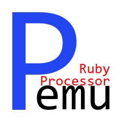

# DISCONTINUED: PEMU 1.13.0 REMOVED RUBY PLUGIN SUPPORT

# PEMU Ruby Processor

## What's PEMU?

[PEMU](https://github.com/Marco4413/ProcessorEmulator) is a Processor Emulator made in Java.

## What's PEMU Ruby Processor?

[PEMU Ruby Processor](https://github.com/Marco4413/pemu-RubyProcessor) is a plugin example for **PEMU**.

It implements a Processor using the [PEMU JRuby API](https://github.com/Marco4413/ProcessorEmulator/blob/master/src/main/resources/PEMUJRubyPluginAPI.rb).

## How to install:

You can follow the tutorial shown in the [PEMU Repo's Plugins' folder](https://github.com/Marco4413/ProcessorEmulator/tree/master/plugins#how-do-i-add-plugins-to-pemu)
